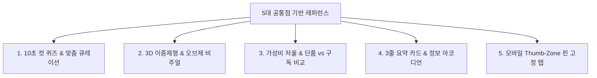

# 🌐 A:FIT (에이핏) 5대 공통점 기반 대표 D2C 레퍼런스 벤치마킹 보고서

> **프로젝트명**: A:FIT (에이핏) - 2030 직장인/1인가구 타깃 상황 맞춤형 이중제형 올인원 구독 서비스  
> **분석 기준**: 200개 D2C 건기식 마스터 데이터 5대 공통 레이아웃 패턴  
> **문서 목적**: 5대 공통점을 가장 완벽하게 구현한 글로벌 및 국내 25대 대표 레퍼런스 매핑  
> **인코딩**: UTF-8  

---

## 📌 5대 공통점 기반 대표 레퍼런스 지도 (Reference Map)

---

## 🔍 1. 10초 컷 퀴즈 & 맞춤 큐레이션 레퍼런스 (Quiz-based Personalization)

> **핵심 요소**: 상품 목록 대신 '성별/연령/피로/수면/숙취' 등 2030 직장인 고민을 선택하는 10초 퀴즈 진입 동선

| 브랜드명 | 웹사이트 URL | 벤치마킹 핵심 포인트 | A:FIT 적용 롤모델 |
| :--- | :--- | :--- | :--- |
| **Ritual** | [ritual.com](https://ritual.com) | 3단계 10초 인터랙티브 퀴즈로 맞춤 비타민 팩 자동 큐레이션 | 🟢 퀴즈 인터페이스 최우선 롤모델 |
| **HUM Nutrition** | [humnutrition.com](https://humnutrition.com) | '피로/수면/피부/숙취' 직장인 일상 고민 키워드 선택 칩 UI 패널 | 🟢 고민 키워드 칩 패널 롤모델 |
| **핏타민 (Fitamin)** | [fitamin.kr](https://fitamin.kr) | 국내 1위 카카오 기반 1분 모바일 문진 & 맞춤 한 포 팩 포장 | 🟢 국내 모바일 문진 동선 롤모델 |
| **필리 (Pilly)** | [pilly.kr](https://pilly.kr) | 건강 퀴즈 문진 알고리즘 기반 증상별 맞춤 파우치 자동 구성 | 🟢 1:1 맞춤 파우치 큐레이션 |
| **Persona Nutrition** | [personanutrition.com](https://www.personanutrition.com) | 의사 알고리즘 기반 복용 약물 상충 관계 체크 퀴즈 | 🟢 전문성 & 안전 신뢰 퀴즈 |

---

## 💎 2. 3D 이중제형/캡슐 & 오브제 비주얼 레퍼런스 (3D Form Factor & Objet Branding)

> **핵심 요소**: 약통 느낌을 벗어난 데스크 위 인테리어 오브제 브랜딩, 3D/투명 캡슐 흡수 기전 모션

| 브랜드명 | 웹사이트 URL | 벤치마킹 핵심 포인트 | A:FIT 적용 롤모델 |
| :--- | :--- | :--- | :--- |
| **Seed** | [seed.com](https://seed.com) | 이중 캡슐(Outer+Inner) 분해 모션 3D 패럴랙스 스크롤 시각화 | 🟣 이중제형 3D 스크롤 모션 |
| **Heights** | [yourheights.com](https://yourheights.com) | 뇌건강 이중 캡슐(Vitals+) 스무스 스크롤 인터랙션 모션 | 🟣 3D 제형 마이크로 모션 |
| **Wholier** | [livewholier.com](https://livewholier.com) | 친환경 재사용 유리병 패키징의 감성적 데스크 오브제 연출 | 🟣 visual noise 배제 브랜딩 |
| **Kroma Wellness** | [kromawellness.com](https://kromawellness.com) | 주방/데스크 인테리어 오브제 스타일링컷 및 호버 확대 | 🟣 인테리어 오브제 연출 |
| **Perelel** | [perelelhealth.com](https://perelelhealth.com) | 딱딱한 약통 대신 럭셔리 뷰티 파우치 패키징 비주얼 | 🟣 파우치 브랜딩 롤모델 |

---

## ⚖️ 3. 가성비 저울 & 단품 vs 올인원 구독 비교 레퍼런스 (Cost Efficiency)

> **핵심 요소**: 단품 5~10개 개별 구매 시 비용 vs 올인원 1포 구독 시 절감되는 가격을 비교 저울 그래프로 제시

| 브랜드명 | 웹사이트 URL | 벤치마킹 핵심 포인트 | A:FIT 적용 롤모델 |
| :--- | :--- | :--- | :--- |
| **AG1 (Athletic Greens)** | [drinkag1.com](https://drinkag1.com) | "75가지 영양소 1스쿱 해결" + 단품 비타민 저울 비교 비주얼 | 🔵 가성비 저울 그래픽 최우선 |
| **Viome** | [viome.com](https://www.viome.com) | 정밀 장건강 RNA 데이터 기반 개별 구매 대비 구독 절감 차트 | 🔵 정량적 가격 절감 그래프 |
| **Life Extension** | [lifeextension.com](https://www.lifeextension.com) | 40년 연구 데이터 기반 단품 조합 vs 올인원 구독 가성비 비교표 | 🔵 가성비 비교표 모듈 |
| **Garden of Life** | [gardenoflife.com](https://www.gardenoflife.com) | 1회 섭취 분량당(단위당) 비용 안내 표 및 유기농 출처 | 🔵 섭취 단위당 비용 계산표 |
| **Vitable** | [vitable.com.au](https://www.vitable.com.au) | 월간 정기 구독 시 할인율 절감 금액 실시간 계산 콤팩트 패널 | 🔵 정기 구독 할인 패널 |

---

## 📋 4. 3줄 요약 카드 & 정보 아코디언 위계 레퍼런스 (3-Line Summary & Accordion IA)

> **핵심 요소**: 복잡한 성분표 대신 [주요 효능 - 원료 출처 - 임상 수치] 3줄 카드 패널로 정리, 상세 내용은 아코디언으로 정돈

| 브랜드명 | 웹사이트 URL | 벤치마킹 핵심 포인트 | A:FIT 적용 롤모델 |
| :--- | :--- | :--- | :--- |
| **Thorne** | [thorne.com](https://www.thorne.com) | NSF 전문가 인증 & [기능별-제형별-타임라인별] 3단 아코디언 | 🔵 3단 아코디언 정보 위계 |
| **Pure Encapsulations** | [pureencapsulations.com](https://www.pureencapsulations.com) | [핵심성분-원료출처-기대효과] 3열 아이콘 요약 패널 | 🔵 3열 요약 아이콘 패널 |
| **Moon Juice** | [moonjuice.com](https://moonjuice.com) | 아답토젠 원료 효과를 3줄 불릿 포인트 및 마우스 호버 카드로 표현 | 🔵 3줄 불릿 요약 카드 |
| **Olly** | [olly.com](https://www.olly.com) | Sleep, Stress, Focus 키워드별 3줄 핵심 효능 요약 | 🔵 고민 키워드 요약 패널 |
| **Rootine** | [rootinevitamins.com](https://rootinevitamins.com) | 복잡한 세포 영양 데이터를 정돈된 3줄 영양 카드로 구조화 | 🔵 3줄 영양 카드 구조화 |

---

## 📱 5. 모바일 Thumb-Zone 핀 고정 구독 탭 레퍼런스 (Mobile Thumb-Zone & Frictionless UX)

> **핵심 요소**: 모바일 화면 엄지손가락 범위(Thumb-Zone)에 퀴즈 진입, 파우치 빌더, 구독 주기 선택버튼 Sticky 고정

| 브랜드명 | 웹사이트 URL | 벤치마킹 핵심 포인트 | A:FIT 적용 롤모델 |
| :--- | :--- | :--- | :--- |
| **Gainful** | [gainful.com](https://gainful.com) | 모바일 카드 스와이프 퀴즈 & 하단 Thumb-Zone 핀 고정 탭 | 🟢 모바일 스와이프 & 핀 고정 |
| **Rootine** | [rootinevitamins.com](https://rootinevitamins.com) | 모바일 슬라이더 터치 조작 시 실시간 파우치 모듈 렌더링 | 🟢 모바일 파우치 빌더 UI |
| **Nurish by Nature Made** | [mynurish.com](https://www.mynurish.com) | 한 손 터치 최적화 카테고리 칩 선택 UI | 🟢 모바일 터치 칩 UI |
| **Ritual** | [ritual.com](https://ritual.com) | 모바일 전용 하단 고정 구독 타깃 버튼 및 3단계 결제 동선 | 🟢 모바일 하단 핀 고정 CTA |
| **핏타민 (Fitamin)** | [fitamin.kr](https://fitamin.kr) | 바쁜 직장인을 위한 모바일 섭취 알림 & 1-Click 구독 관리 마이페이지 | 🟢 1-Click 구독 관리 UI |

---

## 💡 A:FIT 웹 UI/UX 최적 조합 가이드라인

1. **메인 화면 & 브랜드 감성**: **Seed** (3D 이중제형 패럴랙스 모션) + **Ritual** (투명 캡슐 3D 비주얼)
2. **퀴즈 & 파우치 빌딩**: **Rootine** (실시간 파우치 빌더) + **HUM Nutrition** (직장인 고민 칩 선택)
3. **가성비 & 구독 결제**: **AG1** (가성비 저울 비교 비주얼) + **Gainful** (모바일 핀 고정 Thumb-Zone 탭)
