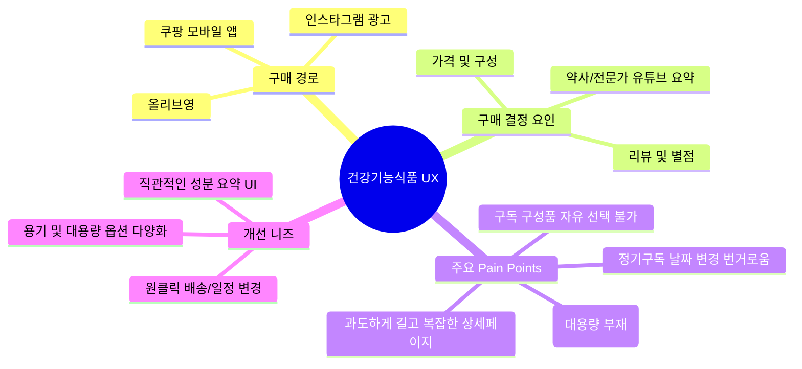

# 🎧 건강기능식품 사용자 인터뷰 음성 분석 보고서

## 📌 1. 개요 및 목적
* **분석 대상 파일**: `음성 260709_174024.m4a`
* **총 오디오 길이**: 약 6분 23초 (383초)
* **분석 목적**: 건강기능식품 / 영양제 / 건강음료 구매 및 정기구독 서비스 사용자의 구매 패턴, Pain Point(불편 사항), 니즈(Needs) 파악을 통한 UI/UX 개선 인사이트 도출

---

## 💡 2. 핵심 분석 요약 (Key Insights)

---

## 🔍 3. 세부 영역별 분석 (Detailed Analysis)

### 🛒 A. 구매 경로 및 채널 이용 행태
1. **플랫폼 활용**:
   * **오프라인/소셜**: 올리브영 매장 이용 및 인스타그램 타깃 광고를 통한 자사몰 연결 구매.
   * **오픈마켓**: 쿠팡 모바일 앱을 통한 검색 구매.
2. **검색 및 선택 패턴**:
   * 검색창에 원하는 영양제 이름을 입력한 뒤 **리뷰 수와 별점이 가장 높은 제품**을 우선적으로 확인.
   * 브랜드 신뢰도보다 **실제 사용자 후기 및 평점**이 구매 결정에 결정적인 역할을 함.

### 💰 B. 구매 판단 기준 & 정보 탐색 방식
1. **가격 및 구성 부담도**:
   * 건강기능식품은 기본적으로 고가라는 인식이 있어, 가격이 너무 비싸면 구매를 주저함.
   * 제품 정보와 함께 **가격 대 성능비(가성비) 및 구성**이 적절하다고 판단될 때 결제 진행.
2. **상세페이지 읽기 기피 및 전문가 요약 선호**:
   * 브랜드 자사몰/오픈마켓 상세페이지의 과도한 전문 용어 및 길고 복잡한 설명은 읽지 않는 경향이 강함.
   * **유튜브 등에서 약사/전문가가 핵심만 요약해 준 추천 영상**을 시청한 후 구매 결정.
   * 💡 **UX 시사점**: 상세페이지 내 **"어디에 좋은가", "누구에게 필요한가"** 중심의 3줄 요약 카드 및 직관적 시각 자료 제공 필요.

### ⚠️ C. 사용자 불편 사항 (Pain Points)

#### 1) 정기구독 서비스 관련 (가장 큰 불편 요소)
* **일정 변경의 높은 허들**: 
  * 정기 배송(예: 매주 화/금) 이용 시 갑작스러운 개인 일정 발생 시 배송일 변경이 어렵고 절차가 번거로움.
  * 변경 신청 타이밍을 놓쳐 제품을 제때 소비하지 못하고 시들해지거나 방치됨.
* **구성 품목 커스텀 불가**:
  * 패키지 구성 중 선호하지 않는 품목(예: 특정 채소/음료)이 포함되어 있어도 원하는 품목만 선택/제외하기 어려움.

#### 2) 영양제 규격 및 후기 검증 한계
* **대용량 옵션 부재**: 대부분의 상품이 1개월~2개월분 단위로만 판매되어, 장기 섭취자를 위한 대용량 기획 구성(3개월/6개월분)의 니즈 존재.
* **효능 정보의 체감 한계**: 일반 화장품 후기와 달리 건강기능식품은 개인 체질에 따른 차이가 커 후기만으로 효능을 판단하기 어려운 한계점 감지.

---

## 🚀 4. UI/UX 및 서비스 개선 제안 (Recommendations)

| 구분 | 현상 및 문제점 | UI/UX 개선 방향 |
| :--- | :--- | :--- |
| **구독 관리** | 배송일 변경 절차가 복잡하여 제품 방치 | **[원클릭 배송 미루기/일정 변경]** 퀵 버튼을 마이페이지 상단에 배치 |
| **품목 구성** | 원하지 않는 구성품 포함 시 선택 불가 | **[커스텀 패키지 빌더]** 사용자가 원하는 품목을 직접 담고 변경할 수 있는 UX 제공 |
| **정보 전달** | 상세페이지 성분 설명이 너무 길고 어려움 | **[3초 요약 카드 UI]** 약사 검증 핵심 효능 및 추천 대상 정보를 상단 팝업/카드로 배치 |
| **상품 구성** | 1~2개월분 위주의 단기 용량만 제공 | **[대용량 가성비 기획전]** 3개월/6개월 정기 대용량 옵션 탭 신설 |

---

## 📜 5. 음성 변환 전체 녹취록 (Full Transcript)

👇 클릭하여 전체 녹취록 보기

### [00:00 - 01:00] 구매 경로 및 구매 판단 기준
* **[00:00 - 00:07]** 질문: 혹시 건강기능식품 구매하실 때 대부분 어디서 구매하실까요?
* **[00:07 - 00:10]** 답변: 올리브영이요.
* **[00:10 - 00:24]** 답변: 인스타 돋보기 타다가 이런 광고가 뜨면 광고랑 홈페이지에 연결되어 있잖아요. 그거 보고 이런 거 있으면 좋겠다고 생각되면 구매하기도 해요.
* **[00:25 - 00:31]** 질문: 그러면 구매하실 때 가장 중요하게 보시는 게 어떤 건가요?
* **[00:33 - 00:59]** 답변: 일단 어떤 음식이 있는지, 그리고 어떤 구성으로 되어 있는지랑 가격을 볼 것 같아요. 건강식품이라고 하면 좀 더 가격이 나갈 것 같다는 생각 때문에 너무 비싸면 구매하기가 망설여져서, 내용 보고 가격도 괜찮다 싶으면 구매합니다.

### [01:00 - 03:00] 음료 섭취 및 정기구독 서비스 불편 경험
* **[01:00 - 01:30]** 질문/답변: 마시는 건강음료 맛이 너무 물약 맛이 나거나 역한 향이면 마시기 어려울 것 같아요. 강한 향이 아니면 먹습니다.
* **[01:40 - 03:10]** 답변 (정기구독 불편사항): 저희가 정기구독으로 신청해서 먹어본 적이 있는데, 매주 화/금 신청을 하잖아요. 그럼 화요일/금요일마다 오는데 갑자기 약속이 생겨서 변동이 안 되니까... 전날 신청하면 된다고 하는데 그게 너무 번거로워서 못 먹을 거 알지만 그냥 받고 못 먹어서 시들해지는 게 불편했어요.
* **[03:10 - 03:12]** 답변 (구성품 불편사항): 채소가 여러 개 있는데 그중에 안 먹고 싶은 건 제외하고 싶은데 선택을 못 하는 점이 아쉬웠습니다.
* **[03:12 - 03:16]** 답변 (개선 희망사항): 바꾸고 싶거나 추가하고 싶을 때 번거로움이 없도록, 날짜 바꾸는 게 제일 편하게 변경될 수 있도록 개선되면 좋겠습니다.

### [03:12 - 06:23] 모바일 앱 구매, 상세페이지 및 용량/포장 의견
* **[03:12 - 03:40]** 답변: 저는 쿠팡 모바일 앱으로 주문해요. 영양제 이름을 치고 후기 별표 제일 두툼한(많고 높은) 거 일단 눌러보는 편입니다.
* **[03:40 - 04:35]** 답변 (상세페이지 UX): 상세페이지 보면 정보가 너무 많아서 잘 안 읽게 돼요. 그냥 유튜브로 약사분들이 요약해 주는 그런 추천 영상 보고 사요. 상세페이지가 좀 간단하고 알기 쉽게 정리되어 있으면 좋겠어요.
* **[04:35 - 06:23]** 답변 (용량 및 포장 방식): 용량이 더 대용량(3개월, 6개월 분)이 있었으면 좋겠고, 약마다 통에 든 것과 톡 털어먹는 타입 등 사용 편의성에 맞춰 나와줬으면 좋겠습니다.

