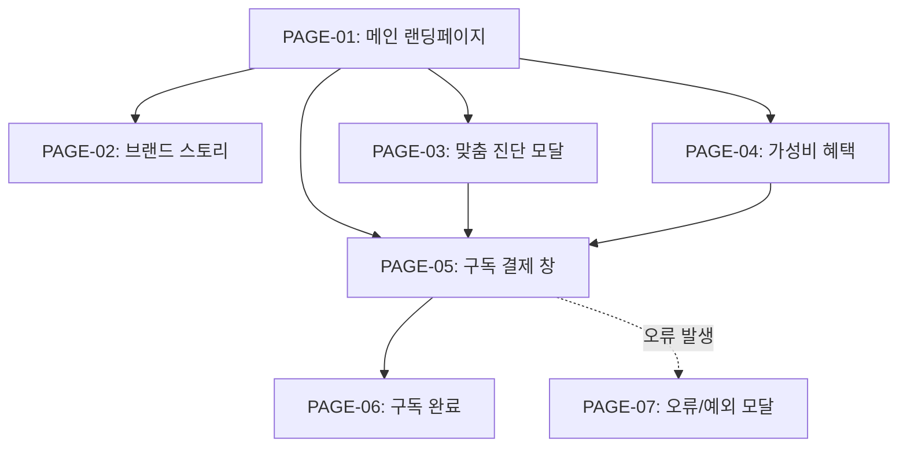

# 🗺️ A:FIT (박지안 [B2C 실제 사용자]) 1차 가상 클라이언트 웹사이트 사이트맵

## 1. 프로젝트 개요
- **프로젝트명**: A:FIT (에이핏) 2030 초개인화 이중제형 건강식 정기구독 서비스 메인 웹사이트
- **클라이언트**: 박지안 ([B2C 실제 사용자] 2030 피로 누적 IT 직장인 페르소나)
- **목적**: 시간과 식비가 부족한 2030 타깃층에게 '식사+영양제 10초 컷' 및 '커피 한 잔 값 가성비' 가치를 전달하여 정기구독 결제 유도
- **타깃층**: 2030 1인 가구, 바쁜 직장인, 취준생, 3교대 간호사, IT 개발자
- **디자인 시스템**: 크림 화이트(#FAF6EB) & 딥 그린(#183D33) 메이저 컬러 기반 미니멀 라이프스타일 오브제 감성

## 2. 설계 근거 및 핵심 사용자 목표
- **설계 근거**: 복잡한 건강식품 상세페이지의 정보 피로도를 극소화하고, 단 10초 만에 혜택 인지 ➔ 15초 스마트 진단 ➔ 가성비 데이터 확신 ➔ 1초 간편 구독 결제로 직결되는 데스크톱/PC 중심 대화형 3-Depth 풀스크린 반응형 내비게이션 구축
- **핵심 사용자 목표**:
  1. 바쁜 아침 식사와 영양제를 한 번에 해결하는 이중제형 가치 인지
  2. 본인 컨디션(회식, 밤샘, 붓기, 야식 등)에 맞춘 캡슐 큐레이션 체험
  3. 편의점 도시락/커피 대비 절감되는 식비 데이터 시각화 확인
  4. 최단 동선 정기구독 신청 및 간편 결제 완료

## 3. 전역 내비게이션 구조 (Global Navigation Structure)
- **Header (GNB)**: A:FIT 로고 | 브랜드 스토리 | 맞춤 진단 | 가성비 혜택 | 구독 신청 | 마이페이지/장바구니
- **Local Navigation (LNB)**: 상황별 큐레이션 이모지 칩 (🌙 밤샘 | 🍺 회식 | 🎈 붓기 | 🍕 야식 | 🔋 피로)
- **Footer**: 기업 정보 | 이용약관 | 개인정보처리방침 | CS 센터 | 하단 고정 구독 Sticky CTA Bar

## 4. 계층형 사이트맵 (Hierarchical Tree Map)
```text
A:FIT 웹사이트 (Depth 3단계)
├─ 1.0 메인 랜딩페이지 (HOME) [PAGE-01]
│  ├─ 1.1 Hero Section (문제 정의 & 10초 컷 카피)
│  ├─ 1.2 3줄 요약 카드 영역 (효능-가성비-편의)
│  ├─ 1.3 앱 연동 스마트 진단 & 큐레이션 모크업
│  ├─ 1.4 가성비 식비 절감 데이터 저울 UI 차트
│  ├─ 1.5 10초 원핸드 섭취 이중제형 GIF/3D 모션
│  ├─ 1.6 18가지 페르소나 공감 후기 슬라이더
│  └─ 1.7 FAQ 아코디언 토글
├─ 2.0 브랜드 스토리 (BRAND) [PAGE-02]
│  ├─ 2.1 2030 시간/식비 부족 페인포인트 분석
│  └─ 2.2 이중제형 보틀+캡슐 특허 기술력 소개
├─ 3.0 맞춤 진단 & 큐레이션 (CURATION) [PAGE-03]
│  ├─ 3.1 3단계 컨디션 퀴즈 인터랙티브 모달
│  └─ 3.2 맞춤 캡슐 매칭 결과 및 팩 구성
├─ 4.0 가성비 & 요금 혜택 (PRICING) [PAGE-04]
│  ├─ 4.1 편의점/배달식 대비 식비 절감 계산기
│  └─ 4.2 주간/월간 정기구독 팩 플랜 선택
├─ 5.0 구독 신청 & 결제 (CHECKOUT) [PAGE-05]
│  ├─ 5.1 배송지 정보 및 주기 설정 (1주/2주/4주)
│  └─ 5.2 1초 간편 결제 (카카오페이/토스/신용카드)
└─ 6.0 예외 및 시스템 페이지 (SYSTEM)
   ├─ 6.1 구독 완료 및 배송 안내 페이지 [PAGE-06]
   ├─ 6.2 진단 결과 없음 / 네트워크 오류 모달 [PAGE-07]
   └─ 6.3 404 Not Found (페이지를 찾을 수 없음) [PAGE-08]
```

## 5. 페이지별 세부 정보 정의 표

| 페이지 ID | 페이지명 | 뎁스 | 목적 | 핵심 콘텐츠 | 주요 기능 | 연결 페이지 |
| :--- | :--- | :---: | :--- | :--- | :--- | :--- |
| **PAGE-01** | 메인 랜딩페이지 | 1Depth | 브랜드 혜택 종합 전달 및 구독 전환 유도 | Hero 카피, 3줄 요약표, 진단 모크업, 가성비 차트, 10초 GIF, 후기 | 큐레이션 칩 필터, 저울 차트 애니메이션, 하단 Sticky CTA | PAGE-02~05 |
| **PAGE-02** | 브랜드 스토리 | 2Depth | 브랜드 철학 및 이중제형 기술 신뢰도 전달 | 2030 페인포인트 통계, 보틀+캡슐 용기 기술력, 라이프스타일 컷 | 3D 용기 분해 뷰어, 기술 특허 팝업 | PAGE-01, PAGE-03 |
| **PAGE-03** | 맞춤 진단 모달 | 2Depth | 개인화 컨디션 측정 및 캡슐 추천 | 3단계 인터랙티브 퀴즈(야식, 수면, 붓기), 매칭 캡슐 팩 | 선택 칩 인터랙션, 추천 결과 즉시 구독담기 | PAGE-01, PAGE-05 |
| **PAGE-04** | 가성비 혜택 | 2Depth | 커피 한 잔 값(3천원대) 가성비 과학적 증명 | 편의점 도시락 대비 절감 계산기, 구독 요금 플랜표 | 절약 금액 슬라이더 계산기, 플랜 선택 라디오 | PAGE-03, PAGE-05 |
| **PAGE-05** | 구독 결제 창 | 3Depth | 최단 동선 정기구독 결제 완료 | 배송 주기 선택, 할인 혜택 내역, 간편 결제 폼 | 1초 간편 결제 연동, 주소 자동입력 | PAGE-06 |
| **PAGE-06** | 구독 완료 | 3Depth | 결제 완료 확인 및 첫 배송 일정 안내 | 구독 신청 내역, 첫 배송일 타임라인, 앱 다운로드 QR | 마이페이지 이동, 카카오톡 알림톡 공유 | PAGE-01 |
| **PAGE-07** | 오류/예외 모달 | Common | 시스템 오류 및 예외 처리 안내 | 오류 원인 메시지, 재시도 안내 버튼 | 이전 단계 돌아가기, CS 연결 | PAGE-01, PAGE-03 |
| **PAGE-08** | 404 안내 | System | 잘못된 경로 진입 방어 | 404 헤드라인, 메인 이동 안내 버튼 | 메인페이지 바로가기 버튼 | PAGE-01 |

## 6. Mermaid Sitemap Flowchart Syntax


