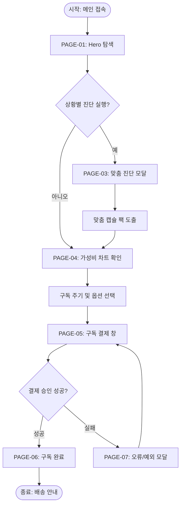

# 🔄 A:FIT (박지안 디렉터) 서비스 흐름도 (Service Flowchart)

## 1. 서비스 흐름 개요
A:FIT 웹사이트의 핵심 사용자 여정(User Journey)은 **[탐색(Hero/카피) ➔ 진단(앱/이모지 칩) ➔ 검증(가성비 데이터/10초 GIF) ➔ 결정(구독 플랜) ➔ 결제(1초 간편결제)]**의 5단계 연속 프로세스로 설계되었습니다.

## 2. 사용자 유형 및 시작 조건
- **신규 2030 직장인/1인가구**: 시간 및 식비 부족 페인포인트를 가진 비회원 ➔ 메인페이지(PAGE-01) 진입
- **재방문 구독자**: 마이페이지 로그인 회원 ➔ 맞춤 캡슐 변경 또는 구독 주기 관리 진입

## 3. 핵심 정상 흐름 (Happy Path)
1. **[메인 진입]**: PAGE-01(메인 랜딩) 접속 ➔ Hero 시간/식비 공감 카피 및 3줄 요약 확인
2. **[스마트 진단]**: 10초 이모지 칩(밤샘/회식/붓기 등) 클릭 또는 AI 진단 시작 ➔ PAGE-03(맞춤 진단 모달) 퀴즈 완료
3. **[가성비 검증]**: 캡슐 매칭 결과 확인 ➔ PAGE-04(가성비 차트)에서 편의점 대비 월 절감액 확인
4. **[구독 옵션 선택]**: 구독 주기(2주/4주) 및 보틀 칼라 선택 ➔ '커피 한 잔 값 구독 시작하기' 클릭
5. **[결제 진행]**: PAGE-05(구독 결제 창) 이동 ➔ 배송지 입력 ➔ 카카오페이/토스 1초 간편 결제
6. **[완료 확인]**: PAGE-06(구독 완료) 이동 ➔ 첫 배송 타임라인 확인

## 4. 분기, 오류, 이탈 및 재진입 흐름
- **[분기 1: 비회원 vs 회원]**: 결제 단계(PAGE-05)에서 비회원 1초 휴대폰 본인인증으로 즉시 자동 가입
- **[오류 1: 결제 실패]**: 잔액 부족 또는 카드 오류 시 PAGE-07(오류 모달) 노출 ➔ 이전 결제수단 선택 화면 유지
- **[오류 2: 필수 입력 누락]**: 배송지 미입력 시 인라인 에러 메시지(Red Text) 표시 및 해당 필드 스크롤 포커싱
- **[이탈 방어]**: 이탈 의도(Exit-Intent) 포커스 이탈 시 "커피 한 잔 값 3천원 할인 쿠폰" 팝업 모달 노출 ➔ 재진입 유도

## 5. 단계별 서비스 프로세스 명세 표

| 단계 | 사용자 행동 | 시스템 처리 (System Action) | 표시 화면 | 다음 진입 조건 |
| :---: | :--- | :--- | :--- | :--- |
| **01** | 메인페이지 접속 | 모바일/PC 레이아웃 최적화, 스크롤 프로그레스 바 로드 | PAGE-01 메인 | 탐색 스크롤 진행 |
| **02** | 상황별 이모지 칩 클릭 | 선택 칩 활성화(Highlight), 매칭 캡슐 3D 비주얼 실시간 체인지 | PAGE-01 / PAGE-03 | 진단 시작 버튼 클릭 |
| **03** | 3단계 컨디션 퀴즈 제출 | 개인화 캡슐 알고리즘 연산 ➔ 최적 캡슐 팩 조합 도출 | PAGE-03 진단 모달 | 결과 확정 및 구독하기 클릭 |
| **04** | 식비 절감 슬라이더 조절 | 주간 절감액 실시간 저울 기울기 애니메이션 연산 | PAGE-04 가성비 차트 | 구독 플랜 선택 |
| **05** | 구독 결제 버튼 클릭 | 로그인 여부 검증 ➔ 결제 레이어 모달 호출 | PAGE-05 결제 창 | 배송지 입력 및 결제 승인 |
| **06** | 간편 결제 승인 | PG사 결제 승인 ➔ DB 구독 등록 ➔ 알림톡 전송 | PAGE-06 완료 창 | 마이페이지 이동 또는 종료 |

## 6. Mermaid Flowchart Diagram Syntax

