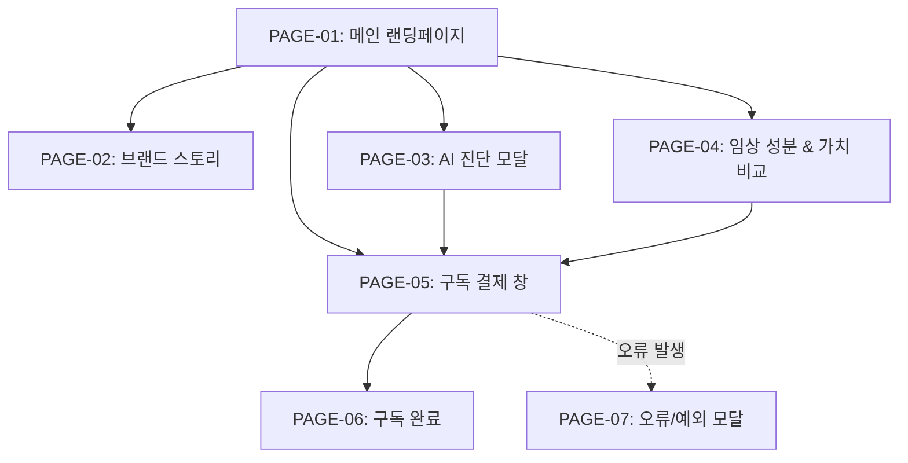

# 🗺️ A:FIT Balance (윤서진 [연구원 의뢰인]) 2차 가상 클라이언트 웹사이트 사이트맵

## 1. 프로젝트 개요
- **프로젝트명**: A:FIT Balance (에이핏 밸런스) 3040 전문직/워킹맘 타깃 프리미엄 이중제형 정기구독 웹사이트
- **클라이언트**: 윤서진 ([연구원 의뢰인] 약학/영양 융합 R&D 연구소장)
- **목적**: 일과 육아, 만성 피로에 시달리는 3040 타깃층에게 임상 검증 특허 성분과 AI 바이오 큐레이션을 통한 하루 15초 프리미엄 웰니스 가치를 전달하고 정기구독 결제 유도
- **타깃층**: 3040 전문직(금융가, 법조인, IT 팀장), 워킹맘/파파
- **디자인 시스템**: 크림 베이지(#F9F7F1) & 세이지 그린(#4A6B5D) 기반 미니멀 럭셔리 웰니스 감성

## 2. 설계 근거 및 핵심 사용자 목표
- **설계 근거**: 복잡한 의학 임상 용어의 피로도를 극소화하고, 단 15초 만에 AI 진단 ➔ 임상/성분 도넛 차트 신뢰 ➔ 낱개 대비 절감 가치 확신 ➔ 1초 프리미엄 간편 결제로 직결되는 모바일 퍼스트 3-Depth 내비게이션 구축
- **핵심 사용자 목표**:
  1. 만성 피로와 중복 영양제 오남용을 해결하는 프리미엄 이중제형 가치 인지
  2. AI 알고리즘 기반 15초 개인 맞춤 바이오 진단 퀴즈 체험
  3. 특허 성분 함량 도넛 차트 및 낱개 영양제 대비 절감 가치 확인
  4. 최단 동선 정기구독 신청 및 간편 결제 완료

## 3. 전역 내비게이션 구조 (Global Navigation Structure)
- **Header (GNB)**: A:FIT Balance 로고 | 브랜드 스토리 | AI 진단 | 임상 성분 | 구독 혜택 | 마이페이지/장바구니
- **Local Navigation (LNB)**: 4대 웰니스 고민 필터 칩 (🔋 만성 피로 | 🌙 수면 장애 | 🛡️ 면역 저하 | ✨ 항산화)
- **Footer**: 기업 정보 | 임상 출처 주기 | 이용약관 | 개인정보처리방침 | 하단 고정 구독 Sticky CTA Bar

## 4. 계층형 사이트맵 (Hierarchical Tree Map)
```text
A:FIT Balance 웹사이트 (Depth 3단계)
├─ 1.0 메인 랜딩페이지 (HOME) [PAGE-01]
│  ├─ 1.1 Hero Section (3040 피로 공감 & 15초 바이오 밸런스 카피)
│  ├─ 1.2 3줄 요약 카드 영역 (임상 검증-AI 맞춤-15초 섭취)
│  ├─ 1.3 AI 바이오 큐레이션 스마트 진단 모크업
│  ├─ 1.4 특허 성분 함량 도넛 차트 & 임상 그래프
│  ├─ 1.5 원터치 15초 앰플+캡슐 이중제형 GIF/3D 모션
│  ├─ 1.6 3040 전문직/워킹맘 실명 후기 슬라이더
│  └─ 1.7 FAQ 토글
├─ 2.0 브랜드 스토리 (BRAND) [PAGE-02]
│  ├─ 2.1 3040 뇌 피로/영양제 오남용 데이터 분석
│  └─ 2.2 세브란스/해외 연구진 임상 특허 성분 기술력 소개
├─ 3.0 AI 바이오 진단 (DIAGNOSIS) [PAGE-03]
│  ├─ 3.1 15초 라이프스타일 퀴즈 인터랙티브 모달
│  └─ 3.2 개인 맞춤 바이오 캡슐 팩 매칭 결과
├─ 4.0 임상 성분 & 가치 비교 (CLINICAL & PRICING) [PAGE-04]
│  ├─ 4.1 낱개 영양제 5종 vs A:FIT 올인원 비용/시간 비교표
│  └─ 4.2 주간/월간 프리미엄 정기구독 팩 플랜 선택
├─ 5.0 구독 신청 & 결제 (CHECKOUT) [PAGE-05]
│  ├─ 5.1 배송지 정보 및 주기 설정 (2주/4주/8주)
│  └─ 5.2 1초 간편 결제 (카카오페이/토스/신용카드)
└─ 6.0 예외 및 시스템 페이지 (SYSTEM)
   ├─ 6.1 구독 완료 및 첫 배송 안내 페이지 [PAGE-06]
   ├─ 6.2 진단 오류 / 결제 실패 예외 모달 [PAGE-07]
   └─ 6.3 404 Not Found 안내 페이지 [PAGE-08]
```

## 5. 페이지별 세부 정보 정의 표

| 페이지 ID | 페이지명 | 뎁스 | 목적 | 핵심 콘텐츠 | 주요 기능 | 연결 페이지 |
| :--- | :--- | :---: | :--- | :--- | :--- | :--- |
| **PAGE-01** | 메인 랜딩페이지 | 1Depth | 브랜드 혜택 종합 전달 및 구독 전환 유도 | Hero 카피, 3줄 요약표, AI 진단 모크업, 성분 차트, 15초 GIF, 후기 | 웰니스 칩 필터, 도넛 차트 모션, 하단 Sticky CTA | PAGE-02~05 |
| **PAGE-02** | 브랜드 스토리 | 2Depth | 브랜드 철학 및 임상 검증 특허 신뢰도 전달 | 3040 영양제 오남용 통계, 임상 특허 성분 기술력, 서재 오브제 컷 | 특허 사본 팝업, 임상 논문 뷰어 | PAGE-01, PAGE-03 |
| **PAGE-03** | AI 진단 모달 | 2Depth | 15초 개인 맞춤 바이오 측정 및 캡슐 추천 | 15초 라이프스타일 퀴즈(피로, 수면, 면역), 매칭 캡슐 팩 | 고민 칩 선택, 추천 결과 즉시 구독담기 | PAGE-01, PAGE-05 |
| **PAGE-04** | 임상 성분 & 가치 비교 | 2Depth | 낱개 영양제 대비 절감 가치 과학적 증명 | 낱개 5종 vs A:FIT 올인원 가치 비교표, 정기구독 플랜표 | 비용 비교 조절기, 플랜 선택 라디오 | PAGE-03, PAGE-05 |
| **PAGE-05** | 구독 결제 창 | 3Depth | 최단 동선 정기구독 결제 완료 | 배송 주기 선택, 혜택 내역, 간편 결제 폼 | 1초 간편 결제 연동, 주소 자동입력 | PAGE-06 |
| **PAGE-06** | 구독 완료 | 3Depth | 결제 완료 확인 및 첫 배송 일정 안내 | 구독 신청 내역, 첫 배송 타임라인, 카카오 알림톡 QR | 마이페이지 이동, 알림톡 공유 | PAGE-01 |
| **PAGE-07** | 오류/예외 모달 | Common | 결제 실패 및 네트워크 장애 처리 안내 | 오류 원인 메시지, 재시도 안내 버튼 | 이전 단계 돌아가기, CS 연결 | PAGE-01, PAGE-05 |
| **PAGE-08** | 404 안내 | System | 잘못된 경로 진입 방어 | 404 헤드라인, 메인 이동 안내 버튼 | 메인페이지 바로가기 버튼 | PAGE-01 |

## 6. Mermaid Sitemap Flowchart Syntax


