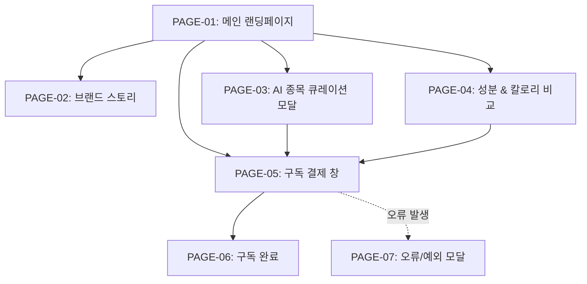

# 🗺️ A:FIT Pro (강민준 [전문가 의뢰인]) 3차 가상 클라이언트 웹사이트 사이트맵

## 1. 프로젝트 개요
- **프로젝트명**: A:FIT Pro (에이핏 프로) 2040 피트니스/러닝족 타깃 당류 0g 바디 부스팅 이중제형 정기구독 웹사이트
- **클라이언트**: 강민준 ([전문가 의뢰인] 전문 스포츠 트레이너 & 피트니스 선수)
- **목적**: 운동을 일상화하는 2040 피트니스/스포츠족에게 당류 0g의 고효율 바디 부스팅과 10초 원터치 섭취 가치를 전달하여 정기구독 결제 유도
- **타깃층**: 2040 피트니스족(러너, 크로스피터, 트레이너, 골퍼, 등산객)
- **디자인 시스템**: 다크 그레이(#1A1A1A) & 네온 그린(#00FF66) 기반 스포티 액티브 퍼포먼스 감성

## 2. 설계 근거 및 핵심 사용자 목표
- **설계 근거**: 운동 직전 빠른 정보 전달이 중요한 스포츠 유저에 맞춰, 단 10초 만에 당류 0g 인지 ➔ 15초 운동 종목 AI 큐레이션 ➔ 스포츠 음료 대비 칼로리/식비 절감 확신 ➔ 1초 Pro 간편 결제로 직결되는 모바일 퍼스트 3-Depth 내비게이션 구축
- **핵심 사용자 목표**:
  1. 설탕/합성첨가물 0g 및 BCAA/전해질 고효율 바디 부스팅 가치 인지
  2. 내 운동 종목(러닝, 웨이트, 골프 등)에 최적화된 AI 아미노산 큐레이션 칩 체험
  3. 당류 0g 도넛 차트 및 시중 스포츠 음료 대비 칼로리 절감 데이터 확인
  4. 최단 동선 정기구독 신청 및 간편 결제 완료

## 3. 전역 내비게이션 구조 (Global Navigation Structure)
- **Header (GNB)**: A:FIT Pro 로고 | 브랜드 스토리 | AI 큐레이션 | 퍼포먼스 성분 | 구독 혜택 | 마이페이지/장바구니
- **Local Navigation (LNB)**: 4대 운동 종목 필터 칩 (🏃 러닝 | 🏋️ 웨이트 | ⛳ 골프 | 🧗 등산)
- **Footer**: 기업 정보 | 스포츠 영양학 출처 주기 | 이용약관 | 개인정보처리방침 | 하단 고정 구독 Sticky CTA Bar

## 4. 계층형 사이트맵 (Hierarchical Tree Map)
```text
A:FIT Pro 웹사이트 (Depth 3단계)
├─ 1.0 메인 랜딩페이지 (HOME) [PAGE-01]
│  ├─ 1.1 Hero Section (당류 0g 공감 & 10초 바디 부스팅 카피)
│  ├─ 1.2 3줄 요약 카드 영역 (당류 0g-종목 맞춤-10초 부스팅)
│  ├─ 1.3 AI 종목별 퍼포먼스 큐레이션 모크업
│  ├─ 1.4 당류 0g & 아미노산 비율 도넛 차트
│  ├─ 1.5 원터치 10초 부스터 앰플+캡슐 GIF/3D 모션
│  ├─ 1.6 스포츠 크루/트레이너 실명 후기 슬라이더
│  └─ 1.7 FAQ 토글
├─ 2.0 브랜드 스토리 (BRAND) [PAGE-02]
│  ├─ 2.1 시중 스포츠 음료 당류 과다 & 근손실 데이터 분석
│  └─ 2.2 부스터 앰플+캡슐 이중제형 특허 부스팅 기술 소개
├─ 3.0 AI 종목 큐레이션 (CURATION) [PAGE-03]
│  ├─ 3.1 3단계 운동 목적 & Intensity 퀴즈 인터랙티브 모달
│  └─ 3.2 운동 종목별 맞춤 부스터 캡슐 팩 매칭 결과
├─ 4.0 퍼포먼스 성분 & 칼로리 비교 (INGREDIENT & PRICING) [PAGE-04]
│  ├─ 4.1 시중 스포츠 음료 vs A:FIT Pro 칼로리/식비 비교표
│  └─ 4.2 주간/월간 Pro 정기구독 팩 플랜 선택
├─ 5.0 구독 신청 & 결제 (CHECKOUT) [PAGE-05]
│  ├─ 5.1 배송지 정보 및 주기 설정 (1주/2주/4주)
│  └─ 5.2 1초 간편 결제 (카카오페이/토스/신용카드)
└─ 6.0 예외 및 시스템 페이지 (SYSTEM)
   ├─ 6.1 구독 완료 및 첫 배송 안내 페이지 [PAGE-06]
   ├─ 6.2 큐레이션 오류 / 결제 실패 예외 모달 [PAGE-07]
   └─ 6.3 404 Not Found 안내 페이지 [PAGE-08]
```

## 5. 페이지별 세부 정보 정의 표

| 페이지 ID | 페이지명 | 뎁스 | 목적 | 핵심 콘텐츠 | 주요 기능 | 연결 페이지 |
| :--- | :--- | :---: | :--- | :--- | :--- | :--- |
| **PAGE-01** | 메인 랜딩페이지 | 1Depth | 브랜드 혜택 종합 전달 및 구독 전환 유도 | Hero 카피, 3줄 요약표, 큐레이션 모크업, 당류 0g 차트, 10초 GIF, 후기 | 운동 종목 칩 필터, 도넛 차트 모션, 하단 Sticky CTA | PAGE-02~05 |
| **PAGE-02** | 브랜드 스토리 | 2Depth | 브랜드 철학 및 당류 0g 이중제형 기술 신뢰도 전달 | 스포츠 음료 당류 과다 통계, 이중 캡슐 부스팅 기술력, 액티브 컷 | 3D 부스터 분해 뷰어, 기술 특허 팝업 | PAGE-01, PAGE-03 |
| **PAGE-03** | AI 종목 큐레이션 모달 | 2Depth | 운동 종목/목적별 3단계 진단 및 캡슐 추천 | 3단계 퀴즈(운동 종목, 주간 횟수, 케어 목적), 매칭 부스터 팩 | 종목 칩 선택, 추천 결과 즉시 구독담기 | PAGE-01, PAGE-05 |
| **PAGE-04** | 성분 & 칼로리 비교 | 2Depth | 스포츠 음료 대비 당류/칼로리 절감 가치 증명 | 시중 음료 vs A:FIT Pro 칼로리 비교표, 정기구독 플랜표 | 칼로리 비교 조절기, 플랜 선택 라디오 | PAGE-03, PAGE-05 |
| **PAGE-05** | 구독 결제 창 | 3Depth | 최단 동선 정기구독 결제 완료 | 배송 주기 선택, 할인 혜택 내역, 간편 결제 폼 | 1초 간편 결제 연동, 주소 자동입력 | PAGE-06 |
| **PAGE-06** | 구독 완료 | 3Depth | 결제 완료 확인 및 첫 배송 일정 안내 | 구독 신청 내역, 첫 배송 타임라인, 카카오 알림톡 QR | 마이페이지 이동, 알림톡 공유 | PAGE-01 |
| **PAGE-07** | 오류/예외 모달 | Common | 결제 실패 및 네트워크 장애 처리 안내 | 오류 원인 메시지, 재시도 안내 버튼 | 이전 단계 돌아가기, CS 연결 | PAGE-01, PAGE-05 |
| **PAGE-08** | 404 안내 | System | 잘못된 경로 진입 방어 | 404 헤드라인, 메인 이동 안내 버튼 | 메인페이지 바로가기 버튼 | PAGE-01 |

## 6. Mermaid Sitemap Flowchart Syntax


