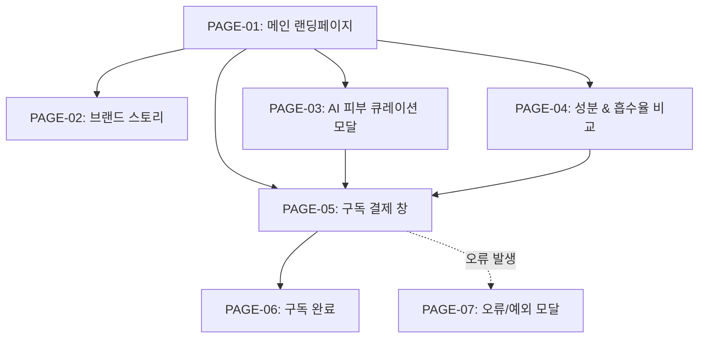

# 🗺️ A:FIT Glow (송아현 [뷰티 파트너]) 웹사이트 계층형 사이트맵 (Sitemap Specification)

> **프로젝트**: A:FIT Glow (2040 뷰티 & 스킨 바이오 케어 올인원 이중제형 정기구독)  
> **대상 클라이언트**: 송아현 ([뷰티 파트너] 글로벌 이너뷰티 브랜드 마케팅 매니저)  
> **수정일시**: 2026-08-12

---

## 1. 사이트 구조 요약 (Depth Structure)

A:FIT Glow 웹사이트는 2040 뷰티 소비자의 정보 접근성을 최적화하기 위해 **최대 3-Depth 이내**의 직관적 계층 구조로 설계되었습니다.

```text
A:FIT Glow 메인 웹사이트
├─ 1-Depth: PAGE-01 메인 랜딩페이지 (Main Landing)
│  ├─ 2-Depth: Hero & 속건조 공감 섹션
│  ├─ 2-Depth: AI 피부 큐레이션 체험 영역
│  ├─ 2-Depth: 바이오 성분 흡수율 시각화 (도넛/바 차트)
│  ├─ 2-Depth: 10초 원샷 바이오 앰플 모션 섹션
│  ├─ 2-Depth: 시중 뷰티 영양제 대비 가치 비교표
│  ├─ 2-Depth: 피부과 전문의 / 뷰티 에디터 후기 슬라이더
│  └─ 2-Depth: Sticky CTA 구독 결제 바
│
├─ 1-Depth: PAGE-02 브랜드 스토리 (Brand Story)
│  ├─ 2-Depth: 겉 피부 케어의 한계 및 속건조 분석
│  └─ 2-Depth: 이중제형 바이오 앰플 특허 메커니즘
│
├─ 1-Depth: PAGE-03 AI 피부 큐레이션 모달 (AI Skin Curation Modal)
│  ├─ 2-Depth: 1단계 피부 고민 선택 (속건조/미백/탄력/트러블)
│  ├─ 2-Depth: 2단계 라이프스타일/클렌징 습관 진단
│  └─ 2-Depth: 3단계 맞춤 바이오 앰플 팩 매칭 결과
│
├─ 1-Depth: PAGE-04 성분 & 흡수율 비교 (Component & Absorption)
│  ├─ 2-Depth: 초저분자 콜라겐 & 글루타치온 흡수율 비교표
│  └─ 2-Depth: Glow 정기구독 혜택 플랜 안내
│
├─ 1-Depth: PAGE-05 구독 결제 창 (Checkout)
│  ├─ 2-Depth: 맞춤 바이오 앰플 수량/주기 선택
│  ├─ 2-Depth: 배송지 정보 입력
│  └─ 2-Depth: 1초 간편 결제 (카카오페이/토스/카드)
│
├─ 1-Depth: PAGE-06 구독 완료 (Order Success)
│  └─ 2-Depth: 첫 배송 타임라인 & 피부 변화 케어 가이드
│
├─ 1-Depth: PAGE-07 오류/예외 모달 (Error Modal)
│  └─ 2-Depth: 결제 실패 / 입력 오류 안내 및 CS 연결
│
└─ 1-Depth: PAGE-08 404 Not Found
   └─ 2-Depth: 존재하지 않는 경로 안내 및 메인 이동
```

---

## 2. Mermaid 구조도



---

## 3. 페이지별 목적 및 주요 기능

| 페이지 ID | 페이지명 | 주요 목적 | 노출 기능 및 컴포넌트 |
| :--- | :--- | :--- | :--- |
| **PAGE-01** | 메인 랜딩페이지 | 뷰티 바이오 가치 전달 및 구독 유도 | Hero, 3줄 요약, AI 큐레이션 모크업, 흡수율 도넛 차트, 10초 GIF, Sticky CTA |
| **PAGE-02** | 브랜드 스토리 | 겉케어 한계 공감 및 기술력 전달 | 속건조 통계, 바이오 앰플 3D 분해 뷰어, 특허 사본 팝업 |
| **PAGE-03** | AI 피부 큐레이션 모달 | 개인별 3단계 맞춤 진단 | 피부 고민 칩, 진단 프로그레스 바, 바이오 앰플 매칭 결과 |
| **PAGE-04** | 성분 & 흡수율 비교 | 성분 신뢰 시각화 및 비용 절감 증명 | 흡수율 비교 그래프, 시중 영양제 대비 비용/시간 비교표 |
| **PAGE-05** | 구독 결제 창 | 최단 결제 동선 제공 | 배송지 폼, 1초 간편 결제 (카카오/토스), 구독 주기 선택 |
| **PAGE-06** | 구독 완료 | 결제 확인 및 웰컴 안내 | 첫 배송 타임라인, 카카오 알림톡 공유, 마이페이지 바로가기 |
| **PAGE-07** | 오류/예외 모달 | 결제/입력 실패 안내 | 에러 원인 안내, 다시 결제하기, CS 채널톡 연결 |
| **PAGE-08** | 404 Not Found | 잘못된 URL 방어 | 404 메시지, 메인으로 이동 버튼 |
