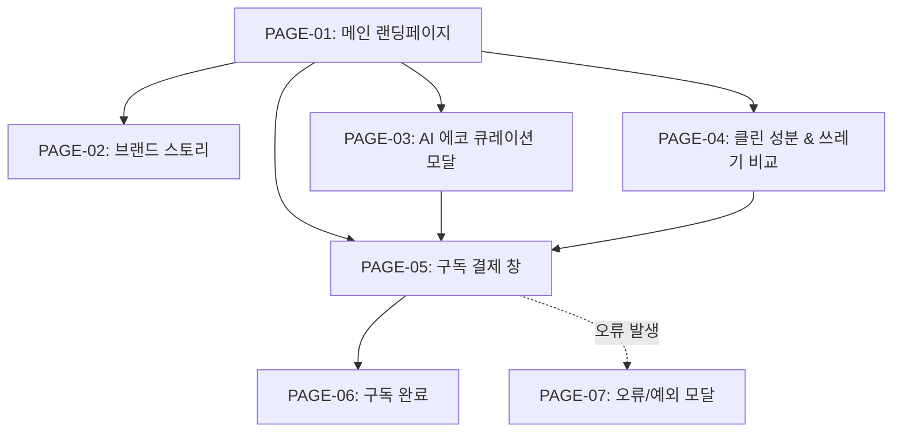

# 🗺️ A:FIT Eco (오유진 [ESG 협력사]) 웹사이트 계층형 사이트맵 (Sitemap Specification)

> **프로젝트**: A:FIT Eco (2040 친환경 가치소비 & 클린 비건 올인원 이중제형 정기구독)  
> **대상 클라이언트**: 오유진 ([ESG 협력사] 친환경 용기 수거 및 재활용 리필 파트너 대표)  
> **수정일시**: 2026-08-12

---

## 1. 사이트 구조 요약 (Depth Structure)

A:FIT Eco 웹사이트는 친환경 가치소비 타깃의 직관적 UX를 위해 **최대 3-Depth 이내**의 계층 구조로 설계되었습니다.

```text
A:FIT Eco 메인 웹사이트
├─ 1-Depth: PAGE-01 메인 랜딩페이지 (Main Landing)
│  ├─ 2-Depth: Hero & 플라스틱 ZERO 공감 섹션
│  ├─ 2-Depth: AI 에코 라이프 큐레이션 영역
│  ├─ 2-Depth: 100% 비건 & 탄소 절감 시각화 (도넛/바 차트)
│  ├─ 2-Depth: 10초 원샷 생분해 앰플 모션 섹션
│  ├─ 2-Depth: 시중 비건 영양제 대비 쓰레기/비용 비교표
│  ├─ 2-Depth: 환경 운동가 / 비건 셰프 후기 슬라이더
│  └─ 2-Depth: Sticky CTA 구독 결제 바
│
├─ 1-Depth: PAGE-02 브랜드 스토리 (Brand Story)
│  ├─ 2-Depth: 용기 쓰레기 및 화학첨가물 이슈 문제 제기
│  └─ 2-Depth: 플라스틱 0% 생분해 보틀 특허 메커니즘
│
├─ 1-Depth: PAGE-03 AI 에코 큐레이션 모달 (AI Eco Curation Modal)
│  ├─ 2-Depth: 1단계 라이프스타일 선택 (비건/제로웨이스트/클린/입문)
│  ├─ 2-Depth: 2단계 식습관 및 환경 관심도 진단
│  └─ 2-Depth: 3단계 맞춤 식물성 바이오 팩 매칭 결과
│
├─ 1-Depth: PAGE-04 클린 성분 & 쓰레기 비교 (Component & Waste)
│  ├─ 2-Depth: 프랑스 100% 비건 인증 & 탄소 발자국 절감 비교표
│  └─ 2-Depth: Eco 정기구독 혜택 플랜 안내
│
├─ 1-Depth: PAGE-05 구독 결제 창 (Checkout)
│  ├─ 2-Depth: 맞춤 에코 팩 수량/주기 선택
│  ├─ 2-Depth: 배송지 정보 입력 및 생분해 용기 회수 동의
│  └─ 2-Depth: 1초 간편 결제 (카카오페이/토스/카드)
│
├─ 1-Depth: PAGE-06 구독 완료 (Order Success)
│  └─ 2-Depth: 첫 배송 타임라인 & 용기 회수 가이드
│
├─ 1-Depth: PAGE-07 오류/예외 모달 (Error Modal)
│  └─ 2-Depth: 결제 실패 / 입력 오류 안내 및 CS 연결
│
└─ 1-Depth: PAGE-08 404 Not Found
   └─ 2-Depth: 존재하지 않는 경로 안내 및 메인 이동
```

---

## 2. Mermaid 구조도



---

## 3. 페이지별 목적 및 주요 기능

| 페이지 ID | 페이지명 | 주요 목적 | 노출 기능 및 컴포넌트 |
| :--- | :--- | :--- | :--- |
| **PAGE-01** | 메인 랜딩페이지 | 플라스틱 ZERO 가치 전달 및 구독 유도 | Hero, 3줄 요약, AI 큐레이션 모크업, 비건 도넛 차트, 10초 GIF, Sticky CTA |
| **PAGE-02** | 브랜드 스토리 | 용기 쓰레기 공감 및 생분해 기술 소개 | 플라스틱 배출 통계, 생분해 보틀 3D 분해 뷰어, 비건 인증서 팝업 |
| **PAGE-03** | AI 에코 큐레이션 모달 | 라이프스타일별 3단계 맞춤 진단 | 에코 타입 칩, 진단 프로그레스 바, 식물성 앰플 매칭 결과 |
| **PAGE-04** | 클린 성분 & 쓰레기 비교 | ESG 신뢰 시각화 및 쓰레기 절감 증명 | 탄소 절감 비교 그래프, 시중 영양제 대비 쓰레기/비용 비교표 |
| **PAGE-05** | 구독 결제 창 | 최단 결제 동선 제공 | 배송지 폼, 용기 회수 체크박스, 1초 간편 결제 (카카오/토스) |
| **PAGE-06** | 구독 완료 | 결제 확인 및 웰컴 에코 안내 | 첫 배송 타임라인, 카카오 알림톡 공유, 마이페이지 바로가기 |
| **PAGE-07** | 오류/예외 모달 | 결제/입력 실패 안내 | 에러 원인 안내, 다시 결제하기, CS 채널톡 연결 |
| **PAGE-08** | 404 Not Found | 잘못된 URL 방어 | 404 메시지, 메인으로 이동 버튼 |
