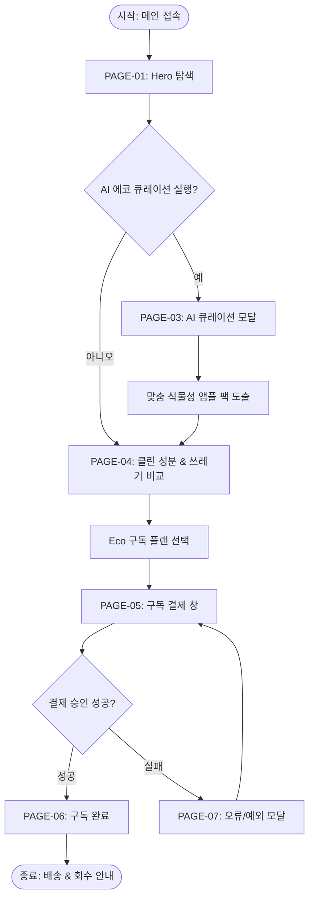

# 🔄 A:FIT Eco (오유진 디렉터) 서비스 흐름도 (Service Flowchart Specification)

> **프로젝트**: A:FIT Eco (2040 친환경 가치소비 & 클린 비건 올인원 이중제형 정기구독)  
> **총괄 디렉터**: 오유진 브랜드 총괄 디렉터  
> **수정일시**: 2026-08-10

---

## 1. 서비스 전체 흐름 (User Journey Flow)

사용자가 A:FIT Eco 메인 웹사이트에 진입하여 **플라스틱 ZERO 및 비건 필요성 인식 ➔ AI 에코 큐레이션 진단 ➔ 쓰레기/탄소 절감 검증 ➔ 정기구독 결제**에 도달하는 프로세스입니다.

```text
[1. 메인 접속]
   │
   ▼
[2. PAGE-01: Hero 플라스틱 ZERO 공감 탐색]
   │
   ├───────► (예: AI 진단 클릭) ──► [3. PAGE-03: AI 에코 큐레이션 3단계 진단]
   │                                           │
   ▼ (아니오: 스크롤 탐색)                      ▼ (진단 완료)
[4. PAGE-04: 쓰레기 절감 비교표 & 비건 차트] ◄──┘ (맞춤 식물성 앰플 팩 추천)
   │
   ▼
[5. Eco 정기구독 플랜 선택]
   │
   ▼
[6. PAGE-05: 최단 결제 동선 (배송지 입력 & 용기 회수 동의 & 1초 결제)]
   │
   ├───────► (결제 승인 성공) ──► [7. PAGE-06: 구독 완료 & 생분해 용기 회수 가이드] (종료)
   │
   └───────► (결제 승인 실패) ──► [8. PAGE-07: 오류/예외 모달] ──► (다시 결제)
```

---

## 2. Mermaid 서비스 흐름도



---

## 3. 단계별 주요 전환 조건 및 예외 명세

1. **AI 에코 큐레이션 진단**:
   - 1단계(라이프스타일: 비건/제로웨이스트/클린/입문), 2단계(식습관 습관), 3단계(필요 식물성 성분) 칩 미선택 시 다음 버튼 비활성화.
2. **구독 결제 유효성 검사**:
   - 성함, 연락처, 배송지 미입력 시 인라인 에러 텍스트 표출 및 결제 승인 요청 차단.
3. **결제 오류 대응 (PAGE-07)**:
   - 한도 초과, 잔액 부족, 네트워크 오류 발생 시 즉각 PAGE-07 모달을 띄우고 "재결제" 및 "CS 채널톡 상담" 이동 버튼 제공.
