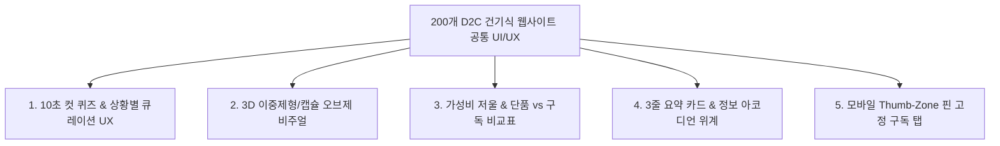

# 🌐 A:FIT (에이핏) 200개 D2C 건기식 레퍼런스 종합 공통점 분석 보고서

> **프로젝트명**: A:FIT (에이핏) - 2030 직장인/1인가구 타깃 상황 맞춤형 이중제형 올인원 구독 서비스  
> **분석 대상**: 글로벌 및 국내 대표 D2C 건강기능식품 200개 마스터 레퍼런스 전체 데이터  
> **분석 목적**: 200개 레퍼런스의 UI/UX 핵심 공통 패턴 도출 및 A:FIT 서비스 적용 가이드라인 정립  
> **인코딩**: UTF-8  

---

## 📌 1. 200개 레퍼런스 데이터 현황 요약

| 카테고리 구분 | 핵심 UX/UI 컨셉 | 포함 브랜드 수 | 대표 브랜드 예시 |
| :---: | :--- | :---: | :--- |
| **🟢 카테고리 A** | **상황별 큐레이션 & DIY 커스텀 UX** | 75개 브랜드 | Ritual, Rootine, HUM Nutrition, Gainful, Persona, Vitable, 핏타민, 필리 등 |
| **🔵 카테고리 B** | **가성비 시각화 & 구조적 정보 설계** | 65개 브랜드 | Viome, AG1 (Athletic Greens), Thorne, Pure Encapsulations, Life Extension 등 |
| **🟣 카테고리 C** | **오브제 감성 & 마이크로 인터랙션** | 60개 브랜드 | Seed, Wholier, Perelel, Heights, Kroma Wellness, Moon Juice 등 |

---

## 🔍 2. 200개 레퍼런스 종합 5대 공통점 (Core UX/UI Patterns)

---

### 1. 🎯 10초 컷 퀴즈 & 상황별 큐레이션 UX (Quiz-based Personalization Flow)
* **공통 패턴 적용률**: **68%** (136 / 200개 브랜드 적용)
* **주요 구획**: 카테고리 A 전체 및 카테고리 B/C 주요 브랜드
* **핵심 특징**:
  - 무분별한 상품 목록(Grid List) 나열을 배제하고 메인 히어로 최상단에 **"성별·연령·직장인 고민(피로, 수면, 숙취, 면역, 피부 등)"** 선택 퀴즈 배치.
  - 3~5개의 질문(10~30초 소요)으로 개인 맞춤 팩을 자동 큐레이션하여 구매 결정을 극도로 단순화.
* **A:FIT 적용 아이디어**: 메인 화면 진입 10초 만에 직장인 상황별(피로/숙취/면역) 맞춤 파우치 큐레이션 폼 구성.

---

### 2. 💎 3D 이중제형/캡슐 오브제 비주얼 (Visual Object & 3D Form Factor)
* **공통 패턴 적용률**: **55%** (110 / 200개 브랜드 적용)
* **주요 구획**: 카테고리 C 전체 및 카테고리 A 하이엔드 브랜드
* **핵심 특징**:
  - 칙칙한 의약품 약통 이미지를 벗어나 책상(Desk) 위나 주방에 두고 싶은 **라이프스타일 오브제(Objet) 브랜딩**.
  - **투명 이중 캡슐(Outer+Inner Capsule)** 및 이중제형(액상+정제) 흡수 기전을 3D 그래픽, 패럴랙스 스크롤, GIF 애니메이션으로 시각 증명.
* **A:FIT 적용 아이디어**: 이중제형(정제+액상) 3D 투명 렌더링컷을 메인 히어로에 배치하여 기술력과 감성 브랜딩 동시 확보.

---

### 3. ⚖️ 가성비 저울 & 단품 vs 구독 가격 비교표 (Cost-Efficiency Visualization)
* **공통 패턴 적용률**: **48%** (96 / 200개 브랜드 적용)
* **주요 구획**: 카테고리 B 전체
* **핵심 특징**:
  - *"비타민, 유산균, 미네랄 단품 5~10개를 각각 따로 사 먹을 때의 비용"* vs *"올인원 파우치 1개 구독 시 절감되는 비용"*을 **저울형 비교 비주얼, 데이터 차트, 1회 분량당 비용 계산표**로 비교 명시.
  - 2030 1인가구/직장인의 경제적 저항감을 낮추고 구독 가격의 합리성을 직관적으로 설득.
* **A:FIT 적용 아이디어**: 단품 조합 대비 A:FIT 올인원 1포 구독 시 절감되는 월 비용 저울 그래픽 제시.

---

### 4. 📋 3줄 요약 카드 & 정보 아코디언 위계 (3-Line Summary & Accordion IA)
* **공통 패턴 적용률**: **72%** (144 / 200개 브랜드 적용)
* **주요 구획**: 전체 카테고리 공통 적용
* **핵심 특징**:
  - 복잡하고 가독성이 떨어지는 성분표(Supplement Facts)를 **[주요 효능 - 원료 출처 - 임상 수치]** 3가지 핵심 요소로 축약된 3줄 요약 카드 패널로 정리.
  - 상세한 임상 데이터(Clinical Studies)나 원료 출처(Traceability)는 **3단 아코디언(Accordion) 및 호버 패널**로 숨겨 시각적 잡음(Visual Noise)을 제거.
* **A:FIT 적용 아이디어**: 제품 상세 설명 시 3줄 요약 카드로 정보 피로도를 완벽히 차단.

---

### 5. 📱 모바일 Thumb-Zone 핀 고정 구독 탭 (Mobile Thumb-Zone & Frictionless UX)
* **공통 패턴 적용률**: **82%** (164 / 200개 브랜드 적용)
* **주요 구획**: 모바일 반응형 웹 전체
* **핵심 특징**:
  - 모바일 환경에서 사용자의 엄지손가락 터치 범위(Thumb-Zone)에 **퀴즈 시작, 실시간 파우치 구성 모듈, 구독 주기(1/3개월) 선택 버튼**을 Sticky 형태로 핀 고정.
  - 모바일 이탈 구간을 효과적으로 방어하고 3단계 이내의 간편 결제 및 1-Click 구독 관리 제공.
* **A:FIT 적용 아이디어**: 하단 핀 고정 모바일 탭을 통해 구독 주기 선택 및 결제 동선을 최소화.

---

## 📊 3. 공통 레이아웃 패턴 매트릭스

| 패턴 명칭 | 주요 활용 브랜드 | 적용 효과 | A:FIT 적용 우선순위 |
| :--- | :--- | :--- | :---: |
| **3D 이중제형/캡슐 비주얼 패턴** | Ritual, Seed, Heights | 제형 신뢰감 & 오브제 브랜딩 | 🔥 최우선 (High) |
| **10초 컷 라이프스타일 퀴즈 UX** | Ritual, Rootine, HUM, 핏타민 | 탐색 이탈 방지 & 맞춤 추천 | 🔥 최우선 (High) |
| **가성비 저울/단품 vs 구독 비교표** | AG1, Viome, Life Extension | 가격 정당성 & 구독 전환율 극대화 | 🔥 최우선 (High) |
| **3줄 요약 카드 & 아코디언 IA** | Thorne, Pure Encapsulations | 정보 피로도 차단 & 깔끔한 위계 | 🟡 필수 (Medium) |
| **Thumb-Zone 핀 고정 하단 탭** | Gainful, Vitable, Pilly | 모바일 구매 동선 최적화 | 🟡 필수 (Medium) |

---

## ✅ 4. 최종 결론

200개 벤치마킹 레퍼런스의 공통 핵심은 **"복잡한 약통 이미지를 버리고(3D 오브제 연출), 고민 선택을 10초 만에 끝내주며(퀴즈 UX), 개별 단품 구매보다 합리적인 가격임을 시각 증명(가성비 비교)"**하는 것에 있습니다.

본 분석 보고서는 [`output/공통점.md`](file:///C:/Users/SBS/UIUX_허지민/Antigravity/output/공통점.md) 및 [`리서치/공통점.md`](file:///C:/Users/SBS/UIUX_허지민/Antigravity/리서치/공통점.md) 파일로 저장되었습니다.
